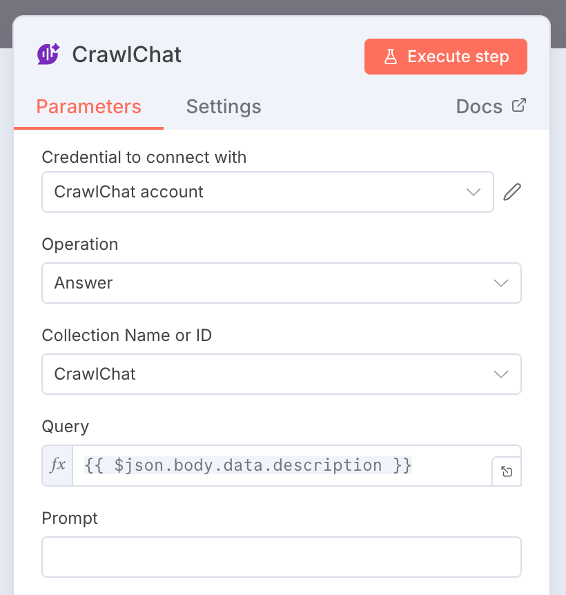
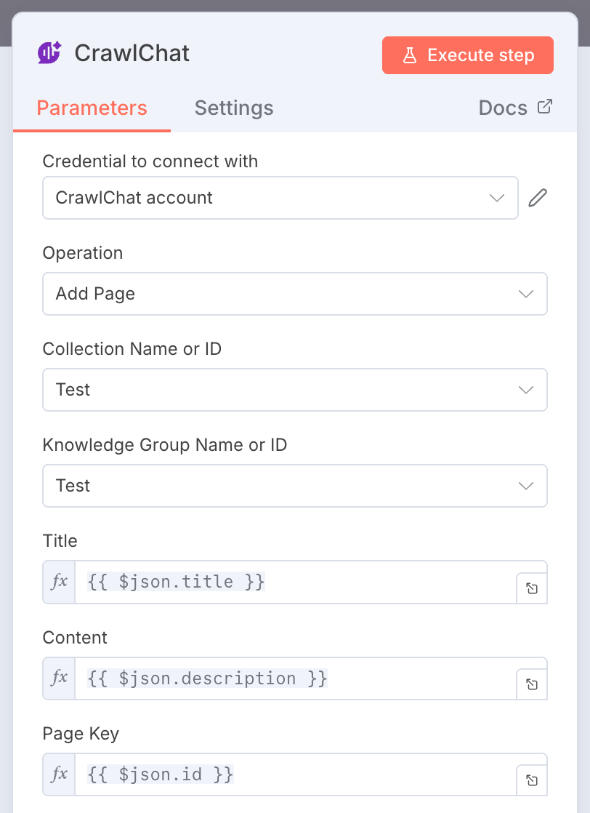
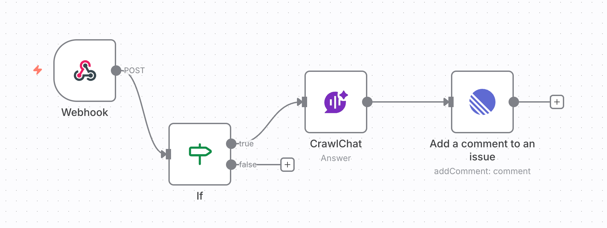
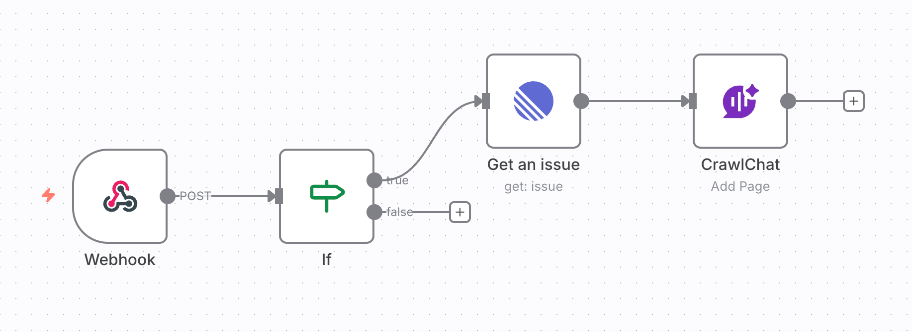

# n8n Node

CrawlChat provides you the **n8n node** so that you can integrate CrawlChat into your workflows to automate answering the queries or to add content to your knowledge base.

You can add the node from following _npm repository_ while the node is _under review_ for cloud version.

```
https://www.npmjs.com/package/n8n-nodes-crawlchat
```

Or install it directly

```
npm i n8n-nodes-crawlchat
```

### Usage

#### 1. Get Your API Key

1. Go to [API Keys](https://crawlchat.app/api-key) on your dashboard
2. Create a new API key
3. Copy the key

#### 2. Add Credentials

1. Search and add the **CrawlChat** node on your n8n workflow
2. Click _Create new credentials_
3. Paste the above created API Key
4. The test should pass
5. Save it

### Operations

You can perform _Answer_ and _Add page_ operations with this node. Following are the details

#### Answer

This operation lets you make an answer from your CrawlChat's knowledge base for a give query.

1. Select the desired CrawlChat collection
2. Drag and drop _query_ from previous nodes or enter
3. You can optionally enter a prompt for this question
4. Once executed, it provides `content` in output as an answer and you can use it in further nodes

Checkout [Answer API](/api/answer) for more details



#### Add page

This operation lets you add new content to your CrawlChat's knowledge base.

1. Select the desired CrawlChat collection
2. Select the _Knowledge group_ to which the content should be added
3. Drag and drop the _Title_ from previous nodes or enter
4. Drag and drop the _Content_ from previous nodes or enter
5. Drag and drop the _Page key_ from previous nodes or enter. This is optional.

Checkout [Add Page API](/api/add-page) for more details



### Use cases

You can use this node when you have a question to be answered from other support platforms such as Linear, Github Issues, Crisp, Zendesk, etc. and reply or add a comment with the answer.



You can also use this node when you have a new content such as resolved Github Issue, Linear Issue, Linear Project, Zendesk ticket, Crisp conversation, etc. and add that to the knowledge base so that it will be used to make answers further.


